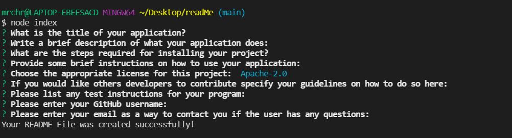

# Read Me Generator

## Table of Contents
* [Description](#description)
* [Installation](#installation)
* [Usage](#usage)
* [License](#license)
* [Contributing](#contributing)
* [Tests](#tests)
* [Questions](#questions)
    
## Description

This project provides an easy way for the user to create a README.md file using node.js. The user will then answer the questions in there terminal, when prompted, and a README.md file will be generated. 

## Installation

First install the "index.js" file and the ".gitignore" file. Then open the terminal in VS code and type in "npm init -y" and click return. This should add a "package.json" file. Next type in "npm i inquirer" and click return. This should add the "package-lock.json" file. Lastly, open the terminal in VS code and type in "node index.js" and the prompts will appear. 

## Usage

Walk-through Video: https://drive.google.com/file/d/14NQH-uPIHGotR2V6J96Hqi6Fw8PBu4s8/view?usp=sharing

Once you have ran the install instructions and you can see the "package.json" and "package-lock.json" you will open terminal and type "node index.js". A series of prompts will ask you to enter information. When you have finished answering all of the prompts it will tell you that a README file was create successfully. You can then click on the README.md to view it, or right click on the README.md file and click open preview to see how it will look on GitHub.

## License
For more information about the license, please click on the link below.

-[License](https:opensource.org/licenses/MIT)

## Contributing

If you would like to contribute or have any suggestions or patches. Please fork from my repo and then message me on GitHub with any recommendations. 

## Tests

There are not any tests at this time. 

## Questions
* GitHub:[ cbeard22](https://github.com/cbeard22)
For any questions please contact me at my email: cbeard@hnoj.org
